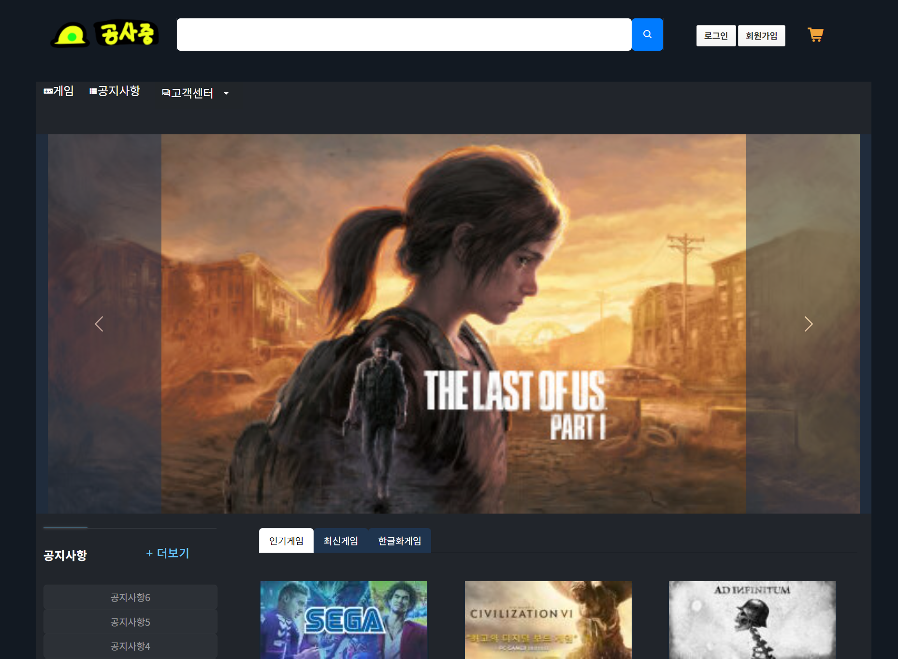

# **Gameseller**
## **게임 판매 포트폴리오**

## **Backend**
>

## **Frontend**
>

## **MindMap**
>

 
 - 메인페이지 회원가입 및 로그인 시 상단 메뉴 마이페이지 및 장바구니 생성

 - 아이디 중복 체크
 - 비밀번호, 비밀번호 확인 동일성 체크
 - 이메일 필수항목 및 이메일 양식 체크
 - 휴대전화번호 양식 체크

<h3>로그인 시 사이트 관리 페이지 상단 노출 </h3>

<h3>상단 메뉴 게임 페이지</h3>

- 게임 페이지 검색 및 리스트

- 게시판 이름과 맞게 게시판 설정
<h4>글쓰기<h4>

- 회원 로그인 시 작성자는 사용자명

- 사진 첨부 테스트
- 조회수 및 IP, 댓글 기능 구현중
- 프론트 진행중
<h3>상단메뉴 고객센터<h3>

- 고객센터 자주 묻는 질문
- 클릭 시 답변

- 전체 질문 게시판 및 간편하게 질문 등록 가능
- 테스트 질문 넣어놓기
<h3>상단 메뉴 마이페이지<h3>
 
- 쇼핑정보 본인 주문 목록
 
- 정보수정
 
- 문의내역
 
- 회원 탈퇴
 
- 장바구니
 
- 주문하기
- 
- 주문 완료 페이지
- 
- 주문서 확인

## **MindMap(ADMIN)**
>

